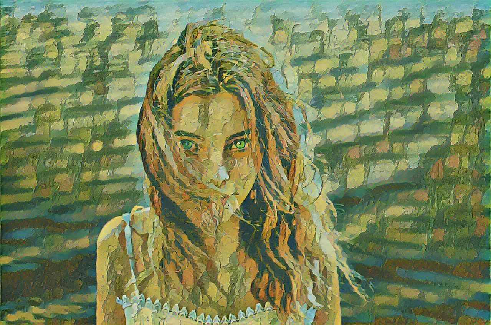

# 🎨 Ghibli Style Transfer AI

Transform your photos into magical **Studio Ghibli-style artwork** using a pre-trained TensorFlow Hub model.  
Powered by deep learning and TensorFlow Lite export support.

<p align="center">
  
</p>
<p align="center">
  
</p>

---

## 🧠 About This Project

This project uses **arbitrary image stylization** from TensorFlow Hub to apply Ghibli-style art to your personal photos.  
Whether you're an anime fan or just love creative photo filters, this tool brings fantasy into reality.

---

## 📦 Features

- 🎨 Apply Ghibli-style art to your own images
- ⚡ Fast and high-quality style transfer using TensorFlow Hub
- 🔍 Output sharpening for enhanced clarity
- 📲 Exportable TFLite model for mobile app integration

---

### 🔧 Requirements

- Python 3.8+
- TensorFlow
- TensorFlow Hub
- Pillow
- NumPy

---

## 🔧 Installation

### 1. Clone the repository
```bash
git clone https://github.com/dinidumaleezha/ghibli-style-transfer.git

cd ghibli-style-transfer

python style_transfer.py
```
---

## 📧 Contact Us

For any inquiries or issues, feel free to contact us:

- 📧 Email: maleezha1975@gmail.com
