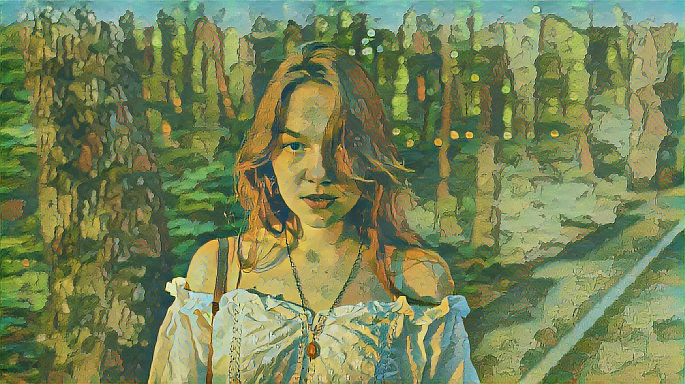

# 🌸 Ghibli Style Image Converter

Transform your photos into dreamy Ghibli-style artwork using TensorFlow and a pre-trained neural style transfer model from TensorFlow Hub.

<p align="center">
  
</p>

---

## 📦 Features

- 🧠 Uses pre-trained model from [TensorFlow Hub](https://tfhub.dev/google/magenta/arbitrary-image-stylization-v1-256/2)
- 🎨 Converts any photo into a Studio Ghibli-inspired stylized image
- 📐 Maintains original resolution and adds slight sharpening for clarity
- 🔁 Exports the model to TensorFlow Lite format

---

## 🚀 Getting Started

### 🔧 Requirements

- Python 3.8+
- TensorFlow
- TensorFlow Hub
- Pillow
- NumPy

Install dependencies:

```bash
pip install tensorflow tensorflow-hub pillow numpy
